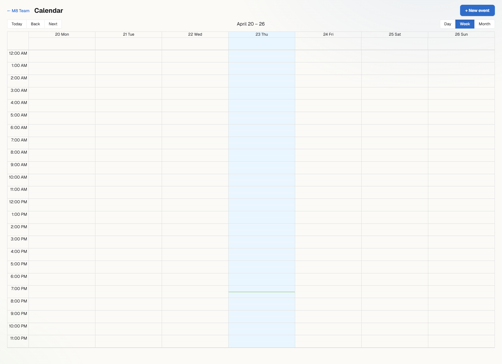
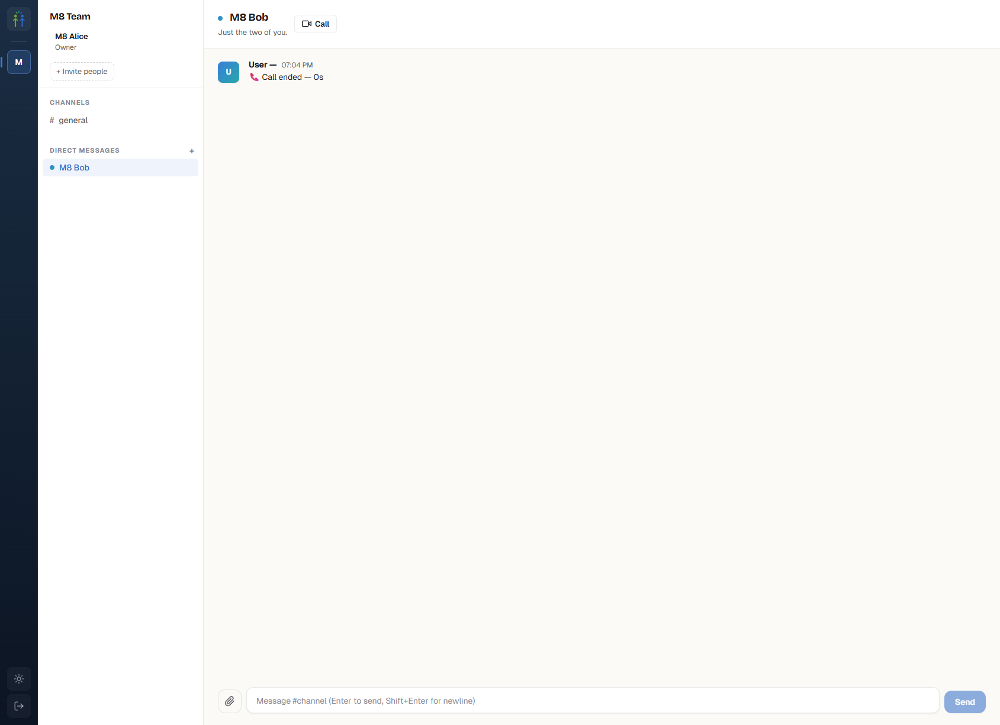
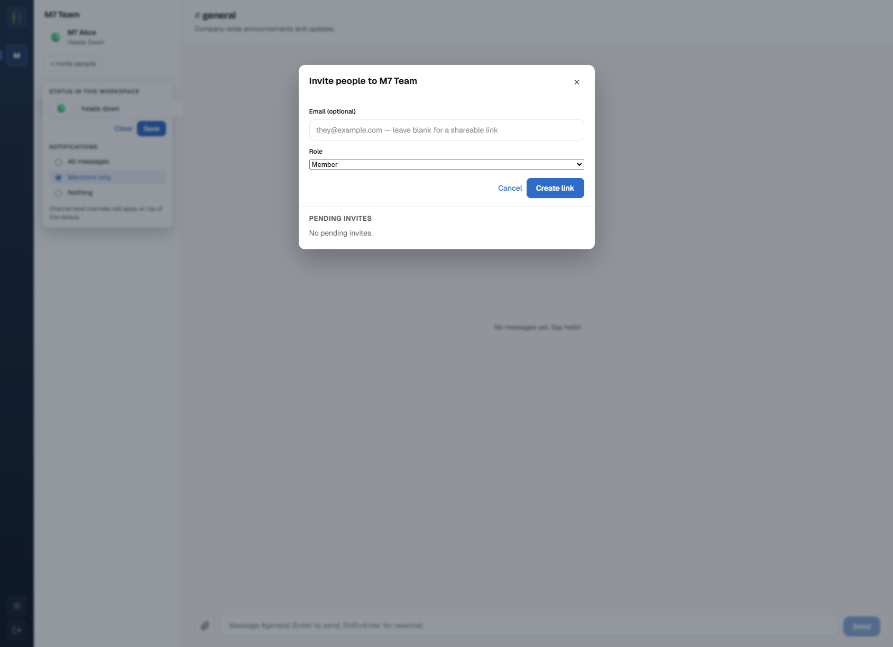
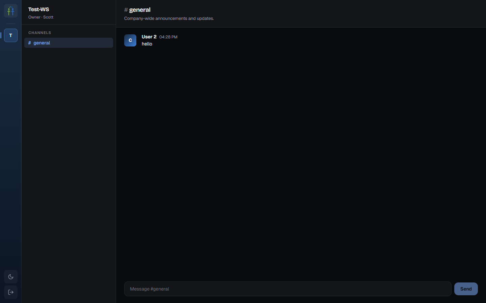
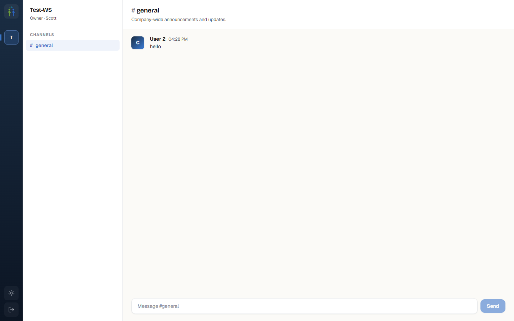

<p align="center">
  
</p>

<h1 align="center">SliilS</h1>

<p align="center">
  <em>Pronounced “slice.”</em> A self-hosted, multi-tenant Slack/Teams alternative for small teams (2–50 users) — with no per-seat tax.<br/>
  <a href="https://sliils.com">sliils.com</a>
</p>

<p align="center">
  
  
  
  
  
</p>

---

## Why this exists

Every team of eight pays $200+ / month for Slack, Teams, or Google Chat and gets locked behind shared infra they cannot audit, move, or own. SliilS is the alternative:

- **Own the stack.** One binary, one Postgres, your box. Backup is `pg_dump`.
- **No per-seat tax.** Add a hundred users. Price stays the same.
- **Teams-class feature surface, Slack-class UX.** All the capabilities below in one self-hosted bundle.
- **Multi-tenant from day one.** One install runs many workspaces with enforced `FORCE ROW LEVEL SECURITY` tenant isolation.

## What's in the box

- **Messaging** — channels, threads, direct messages, group DMs, reactions, mentions, typing indicators, presence, per-channel mute
- **Voice + video calls** — 1:1 DM calls and channel meetings powered by a self-hosted LiveKit SFU, with an incoming-call banner, background blur, and a post-call summary message. Scheduled meetings from the calendar bridge straight into the same room.
- **Calendar** — RFC 5545 recurring events (RRULE), RSVPs, reminders 4-6 min before start, iCal feed URL for Apple/Outlook subscription, bidirectional Google Calendar sync
- **Files** — multipart upload with EXIF strip, SHA-256 per-workspace dedupe, drag-drop attachments, pluggable storage driver (local at v1, S3/SeaweedFS interface ready)
- **Office docs + collaborative pages** — `.docx` / `.xlsx` / `.pptx` editing via Collabora Online (WOPI); native collaborative pages backed by Yjs + Y-Sweet with TipTap, version history, and inline comments
- **Search** — Meilisearch-backed, ⌘K global overlay, `from:@user in:#chan has:file` operators, tenant-token HMAC ACL so private channels never leak
- **Push notifications** — VAPID web push with a service worker, Signal-style opaque payloads (no message body on the wire to APNs/FCM), per-user DND + quiet-hours + per-channel mute
- **Apps platform** — OAuth 2.0 + PKCE installable apps, bot users, Slack-shaped `chat.postMessage` + `auth.test`, Block-Kit JSON, incoming + outgoing webhooks, slash commands — existing Slack SDKs work with a base-URL swap
- **Admin dashboard** — members + role management, retention policies, audit log viewer, workspace branding, one-click GDPR per-user export + full-workspace ZIP export

## Status

**M12 of 12 shipped** — SliilS now has the full feature surface from the original roadmap. Release hardening (Lighthouse a11y gate, manual screen-reader pass, full i18n translation, security review sign-off) is the next phase before v1.0 tag. See [docs/kickoff/implementation-roadmap.md](docs/kickoff/implementation-roadmap.md) for the plan and [docs.sliils.com](https://github.com/newtro/sliils/blob/main/docs/) for user + developer docs.

| # | Milestone | State | Highlights |
|---|---|---|---|
| M0 | Bootstrap | ✅ | Go / Echo / sqlc / Goose / pnpm monorepo |
| M1 | Auth | ✅ | Argon2id + JWT, magic-link, verify-email, reset-password — no Firebase |
| M2 | Workspaces + RLS | ✅ | Per-request `SET LOCAL app.workspace_id`, `FORCE ROW LEVEL SECURITY`, non-owner DB role |
| M3 | Realtime messaging | ✅ | Partitioned `messages` (monthly), WS broker w/ reconnect + diff-sync, edits, reactions |
| M4 | Threads & presence | ✅ | `<@user>` mentions, typing indicators, presence, per-channel unread + mention counters |
| M5 | Files | ✅ | Multipart upload, EXIF strip, SHA-256 dedupe, drag-drop, `IStorage` interface |
| M6 | Search | ✅ | Meilisearch + River + transactional outbox + tenant-token HMAC + ⌘K overlay |
| M7 | Multi-workspace identity | ✅ | Invite flow (email + link), per-workspace custom status, per-workspace notify pref |
| M8 | Voice / video calls | ✅ | LiveKit SFU + DMs + meetings, incoming-call banner, background blur |
| M9 | Calendar | ✅ | RFC 5545 RRULE, RSVPs, reminders, iCal feed, Google Calendar bidirectional sync |
| M10 | Pages + Collabora | ✅ | TipTap + Yjs via Y-Sweet, page comments + version history, WOPI for .docx/.xlsx/.pptx |
| M11 | Push notifications | ✅ | VAPID web push, service worker, DND / quiet hours, mention + DM fanout |
| M12 | Apps platform + admin + GA | ✅ | OAuth 2.0 + PKCE, Block-Kit, bot API, webhooks, slash cmds, admin dashboard, GDPR export, docs site |

### Screenshots

<p align="center">
  
  
</p>
<p align="center">
  
  
</p>
<p align="center">
  
  
</p>

More in [docs/screenshots/](docs/screenshots/).

## Architecture in one breath

```
┌──────── Browser ────────┐    ┌───── External processes (native binaries) ─────┐
│  React 19 SPA (Vite)    │    │  Meilisearch  LiveKit  Y-Sweet  Collabora*     │
│  y-sweet client         │    └──────────────────────┬──────────────────────────┘
│  TipTap / react-big-cal │                           │
└────────────┬────────────┘                           │
             │ HTTPS + WSS                            │
             ▼                                        │
┌─────────── Go app server (Echo) ────────────────────┴────────────┐
│  handlers  ·  in-proc realtime broker  ·  River worker queue     │
│  search drain / snapshots / calendar-sync / event reminders      │
└────────────┬─────────────────────────────────────────────────────┘
             │ pgx (tenant pool: RLS-forcing role)
             │ pgx (owner pool: bypasses RLS for workers + migrations)
             ▼
       PostgreSQL 18  (+ FORCE ROW LEVEL SECURITY on every tenant table)
```
\* Collabora requires Linux; WOPI endpoints + Office-doc UI work in dev without it.

Key design locks:

- **Multi-tenant isolation is enforced by Postgres, not app code.** Every tenant table has `FORCE ROW LEVEL SECURITY`; the runtime role has no bypass. If a handler forgets to set `app.workspace_id`, the query returns zero rows — not the wrong rows.
- **Owner pool / tenant pool split.** Handlers use the RLS-forcing pool. Workers (search indexer, snapshot sweep, calendar sync) use the owner pool — they operate across tenants intentionally, one tenant per tx.
- **Transactional outboxes.** Search indexing is a `search_outbox` table drained by River. Survives a Meilisearch outage without losing events.
- **Scoped tokens everywhere.** Meilisearch tenant tokens HMAC-bake `workspace_id` + `visible_to_user_ids`. WOPI access tokens bind a specific `file_id`. LiveKit join tokens are room-scoped.

Read the full spec in [docs/kickoff/tech-spec.md](docs/kickoff/tech-spec.md).

## Quick start (local dev)

### Prerequisites

- **Node.js** ≥ 22 and **pnpm** ≥ 10
- **Go** ≥ 1.25
- **PostgreSQL** 17+ — native install recommended on Windows
- **sqlc** (only if you change `internal/db/queries/*.sql`)

Optional sidecar services (all run as **native binaries** — no Docker required for dev):

| Service | Purpose | Installed via |
|---|---|---|
| [Meilisearch](https://www.meilisearch.com/) | Full-text search | native binary |
| [LiveKit](https://livekit.io/) | Voice/video SFU | native binary |
| [Y-Sweet](https://github.com/drifting-in-space/y-sweet) | Yjs collab server for Pages | `npm i y-sweet` auto-fetches binary |

### First-time setup

```bash
pnpm install

# One-time: local dev database
createdb -U postgres sliils_dev
psql -U postgres -d sliils_dev -c "CREATE EXTENSION citext;"

# Configure the server
cp apps/server/.env.example apps/server/.env
# edit apps/server/.env — at minimum set SLIILS_JWT_SIGNING_KEY and SLIILS_RESEND_API_KEY
```

### Run the dev loop

```bash
# Terminal 1 — start sidecars you want (skip any you don't need)
meilisearch --db-path ./data/meilisearch --master-key dev-master-key
livekit-server --config ./config/livekit-dev.yaml
y-sweet serve ./data/y-sweet --port 8787

# Terminal 2 — API server (auto-runs migrations)
pnpm dev:server

# Terminal 3 — web app
pnpm dev
```

Web app → [http://localhost:5173](http://localhost:5173). API → [http://localhost:8080](http://localhost:8080).

### Tests

```bash
# Unit tests (no external services)
pnpm test
pnpm go:test

# Go integration tests — require a throwaway sliils_test DB
createdb -U postgres sliils_test
psql -U postgres -d sliils_test -c "CREATE EXTENSION citext;"

cd apps/server
go test -tags=integration ./internal/server/...

# Full CI suite locally
pnpm ci:all
```

Integration tests reset the schema on every test, so re-run freely.

## Repository layout

```
.
├── apps/
│   ├── server/        Go — Echo + sqlc + River + pgx
│   ├── web/           Vite + React 19 + React Router 7 SPA
│   ├── desktop/       Tauri 2 wrapper (scaffolded, pre-M11)
│   └── mobile/        Expo / React Native (scaffolded, pre-M11)
├── packages/
│   ├── ui/            Shared UI primitives
│   ├── api/           Shared TypeScript API types
│   └── schemas/       Shared Zod schemas
├── docs/
│   ├── kickoff/       Implementation-ready specs (read these first)
│   └── screenshots/   Demo screenshots per milestone
├── config/            Sidecar configs (LiveKit, Caddy, etc.)
├── docker-compose.yml Full-stack prod compose (Linux-first)
└── Caddyfile          TLS + reverse proxy for single-VM deploy
```

## Build an app against SliilS

The apps platform accepts OAuth-installable third-party integrations with Slack-shaped API surface. Existing Slack SDKs work with a base-URL swap.

```bash
# Developer creates an app
POST /api/v1/dev/apps  { "slug":"hello-bot", "manifest":{...} }
# → returns client_id + client_secret (shown once)

# Admin installs into workspace via OAuth + PKCE
GET /api/v1/oauth/authorize?client_id=...&code_challenge=...

# Developer's backend exchanges the code
POST /api/v1/oauth/token  (authorization_code + PKCE verifier)
# → returns slis-xat-... access token

# Bot posts a message
POST /api/v1/chat.postMessage  { "channel":"1", "text":"hi", "blocks":[...] }
```

Full walk-through: [docs/apps/quickstart.md](docs/apps/quickstart.md).

## Operations

Run the binary under a supervisor so it can self-restart when a super-admin changes install-level infrastructure (VAPID keys, Collabora URL, Y-Sweet token, LiveKit credentials). The Admin → Integrations tab surfaces a "Restart server" button that exits the process cleanly — the supervisor brings it back with the updated settings. A bare `./sliils-app` run has no supervisor, so the button hides and the UI shows a shell-command hint instead.

```ini
# systemd unit example
[Service]
ExecStart=/usr/local/bin/sliils-app
Restart=on-success
RestartSec=1s
```

```yaml
# docker compose snippet
services:
  sliils-app:
    image: sliils/app:latest
    restart: unless-stopped
```

Email + signup-mode changes apply immediately; only the four infrastructure cards require a restart.

## Documentation

End-user + developer docs live under [docs/](docs/) and render as a site via `mkdocs serve`:

- [Self-hosting guide](docs/self-hosting/local-dev.md) · [Production deploy](docs/self-hosting/production.md) · [Security checklist](docs/self-hosting/security-checklist.md)
- [Apps platform overview](docs/apps/overview.md) · [Quickstart](docs/apps/quickstart.md) · [OAuth](docs/apps/oauth.md) · [Bot API](docs/apps/bot-api.md) · [Webhooks](docs/apps/webhooks.md) · [Slash commands](docs/apps/slash-commands.md) · [Block-Kit](docs/apps/block-kit.md)
- [Admin guide](docs/admin/members.md) — members · retention · export
- [API reference](docs/reference/api.md) · [WebSocket protocol](docs/reference/ws.md) · [Schema](docs/reference/schema.md)

Implementation-ready specs that shaped every milestone live in **[docs/kickoff/](docs/kickoff/)**:

| Read this to… | File |
|---|---|
| Pitch in 30s | [project-plan.md](docs/kickoff/project-plan.md) |
| Know what's being built | [requirements.md](docs/kickoff/requirements.md) |
| Understand the architecture | [architecture.md](docs/kickoff/architecture.md) |
| Implement backend / data / API | [tech-spec.md](docs/kickoff/tech-spec.md) |
| Design or build UI | [ui-spec.md](docs/kickoff/ui-spec.md) |
| See user flows | [workflows.md](docs/kickoff/workflows.md) |
| Start coding the next milestone | [implementation-roadmap.md](docs/kickoff/implementation-roadmap.md) |
| See all 35 architecture decisions | [adr/](docs/kickoff/adr/) |
| Know what could go wrong | [risk-register.md](docs/kickoff/risk-register.md) |
| Know what's still unvalidated | [assumptions.md](docs/kickoff/assumptions.md) |
| Decode project vocabulary | [glossary.md](docs/kickoff/glossary.md) |

## Contributing

This is a solo + AI-assistant development project targeting v1. Issues and PRs are welcome once the repo hits M12 / first public release; for now the roadmap is fixed and the codebase changes on a daily cadence.

## License

MIT — see [LICENSE](LICENSE).

Logo and brand name © 2026 SliilS. Trademark usage restrictions apply even under MIT.
